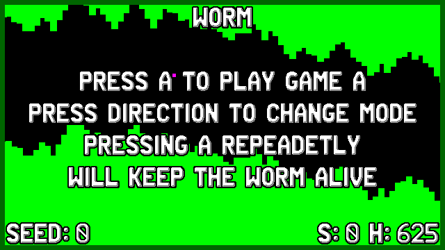
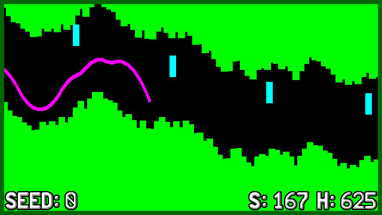

# Worm Vircon32
   

  

This is my [Vircon32 fantasy console](http://www.vircon32.com/) worm game, which is a remake of the classic copter / worm game with multiple gameplay modes

## Controls

| Key        | Action                                           |
|------------|--------------------------------------------------|
| A          | Select GAME A, Repeadetly tap to move Worm       |
| B          | Select GAME B                                    |
| Y          | Select GAME C                                    |

## Aim of the game
Repeadetly Press / hold A button to move the worm around, dont hit obstacles and walls, try to gain highest score.

## License
* License of my part of game's code is MIT
* Game uses DrawPrimitives and TextFonts from [@vircon32](https://www.github.com/vircon32) in libs dir it's license is 3-Clause BSD License.
* game uses a font Asset (TextureFont22x32.png) created by [@vircon32](https://www.github.com/vircon32) provided under CC BY 4.0 License